<div align="center">

# Manufacturing Analytics Portfolio

**Six working tools for pharmaceutical and process manufacturing** — each with a
dependency-free Python library, unit tests and a live interactive dashboard.

[](https://marknwilliam.github.io/manufacturing-analytics/)
[](#)
[](#)
[](#)

</div>

---

This is the landing page for a set of small, honest manufacturing-engineering
tools: every one encodes a real method (OEE decomposition, USP &lt;645&gt;,
logistic failure risk, margin &amp; yield), comes with a unit-test suite you can
run on any stock Python 3.9+, and ships a zero-dependency browser dashboard
that opens offline.

| # | Tool | What it answers | Repo · Live demo |
|---|------|-----------------|------------------|
| 1 | **OEE Dashboard** | How effective is the line, and which loss class is bleeding it? | [repo](https://github.com/MarkNwilliam/oee-dashboard) · [demo](https://marknwilliam.github.io/oee-dashboard/) |
| 2 | **Batch Manufacturing Dashboard** | Are yield, cycle time and rejections trending the right way? | [repo](https://github.com/MarkNwilliam/batch-manufacturing-dashboard) · [demo](https://marknwilliam.github.io/batch-manufacturing-dashboard/) |
| 3 | **Root Cause Analysis Tool** | Why did the deviation happen, and what CAPA stops it recurring? | [repo](https://github.com/MarkNwilliam/root-cause-analysis-tool) · [demo](https://marknwilliam.github.io/root-cause-analysis-tool/) |
| 4 | **Predictive Maintenance** | What is P(failure in the next 30 days)? | [repo](https://github.com/MarkNwilliam/predictive-maintenance) · [demo](https://marknwilliam.github.io/predictive-maintenance/) |
| 5 | **Water System Monitoring** | Is the purified-water loop within USP limits, and when must we sanitise? | [repo](https://github.com/MarkNwilliam/water-system-monitoring) · [demo](https://marknwilliam.github.io/water-system-monitoring/) |
| 6 | **Manufacturing Cost Analysis** | Which product makes money; which process wastes the most? | [repo](https://github.com/MarkNwilliam/manufacturing-cost-analysis) · [demo](https://marknwilliam.github.io/manufacturing-cost-analysis/) |
| 7 | **Tablet Sticking Predictor** | Which granule batch will stick least on the press? | [repo](https://github.com/MarkNwilliam/tablet-sticking-predictor) · [demo](https://marknwilliam.github.io/tablet-sticking-predictor/) |
| 8 | **Granule PSD Analyzer** | What are the D values, span and fines of the granulation? | [repo](https://github.com/MarkNwilliam/granule-psd-analyzer) · [demo](https://marknwilliam.github.io/granule-psd-analyzer/) |
| 9 | **OSD Tablet QC Dashboard** | Do the tablets pass weight, AV, friability and hardness? | [repo](https://github.com/MarkNwilliam/osd-tablet-qc-dashboard) · [demo](https://marknwilliam.github.io/osd-tablet-qc-dashboard/) |
| 10 | **Batch Assay Calculator** | What is the assay and % label claim of the batch? | [repo](https://github.com/MarkNwilliam/batch-assay-calculator) · [demo](https://marknwilliam.github.io/batch-assay-calculator/) |
| 11 | **Cumulative Hold Time Calculator** | Is the batch sitting too long before compression? | [repo](https://github.com/MarkNwilliam/cumulative-hold-time-calculator) · [demo](https://marknwilliam.github.io/cumulative-hold-time-calculator/) |

---

## Tool previews

| OEE Dashboard | Batch Manufacturing |
|---|---|
| [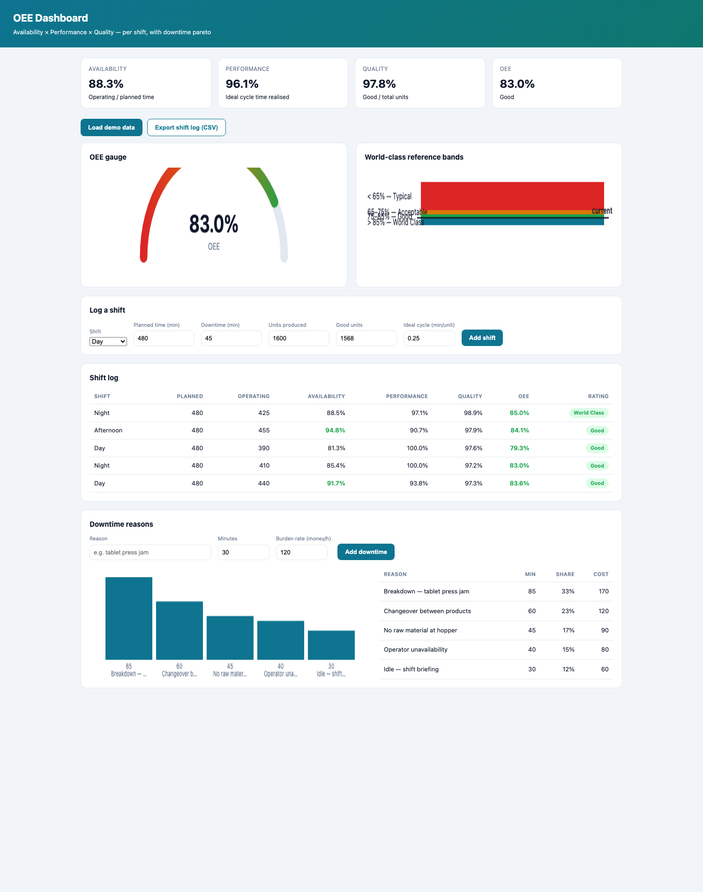](https://marknwilliam.github.io/oee-dashboard/) | [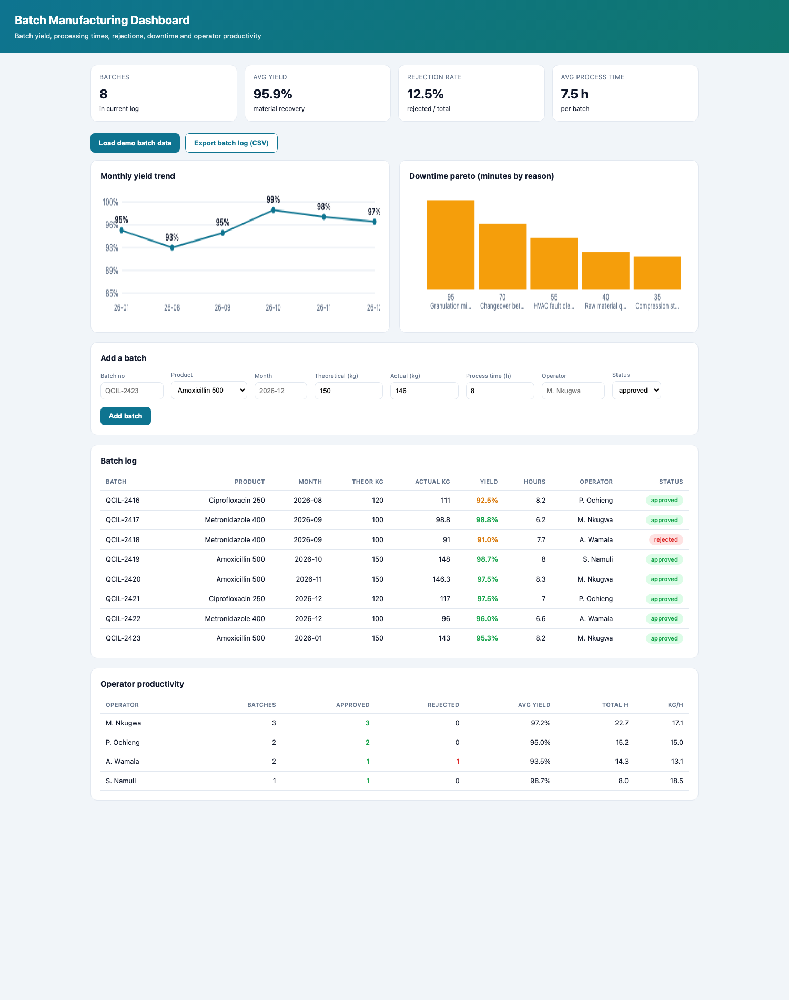](https://marknwilliam.github.io/batch-manufacturing-dashboard/) |

| Root Cause Analysis | Predictive Maintenance |
|---|---|
| [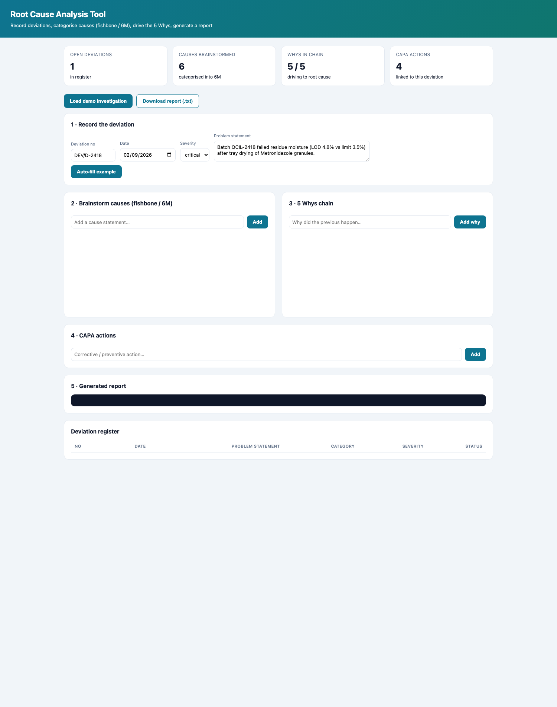](https://marknwilliam.github.io/root-cause-analysis-tool/) | [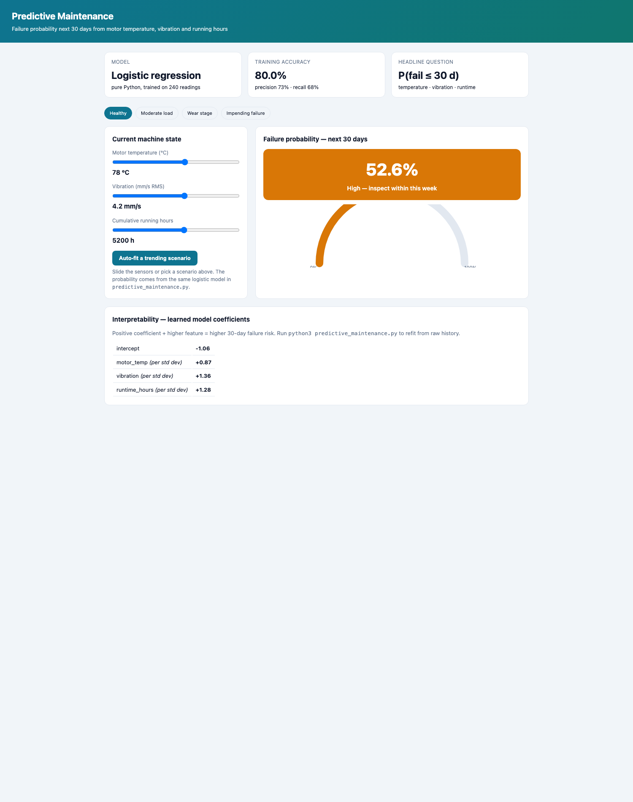](https://marknwilliam.github.io/predictive-maintenance/) |

| Water System Monitoring | Manufacturing Cost Analysis |
|---|---|
| [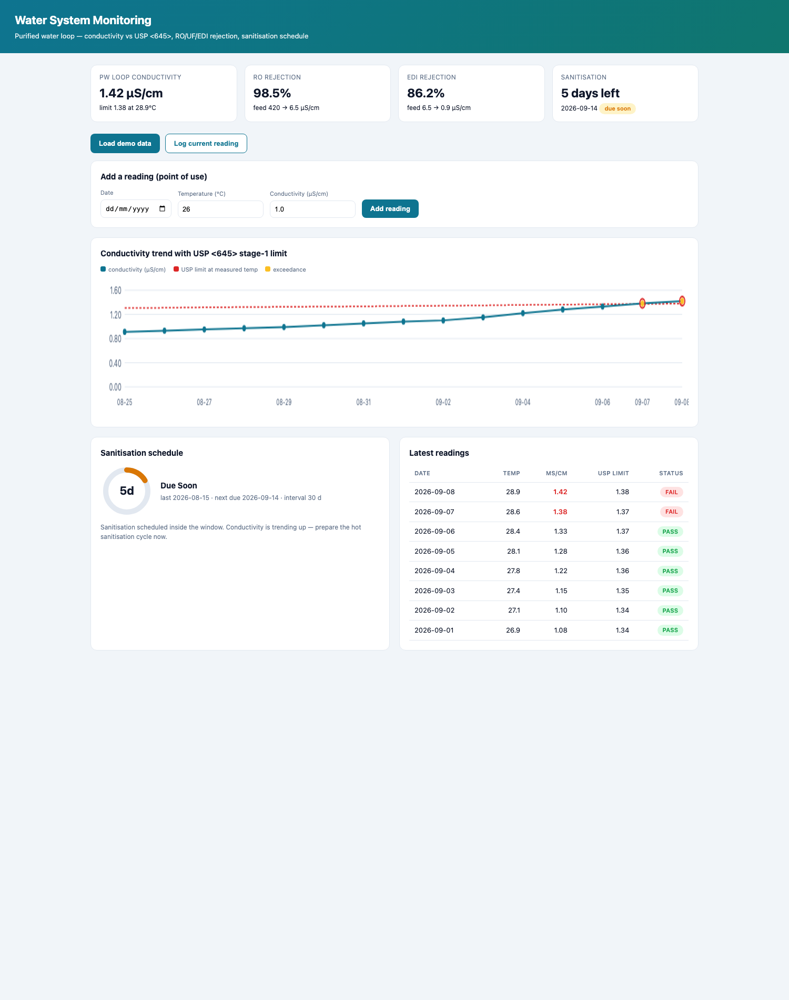](https://marknwilliam.github.io/water-system-monitoring/) | [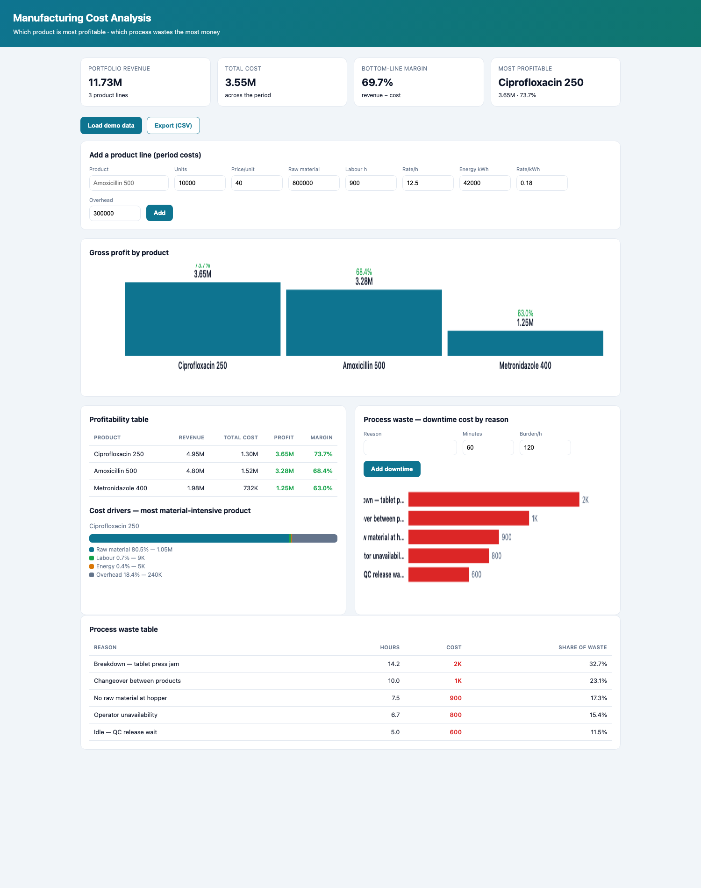](https://marknwilliam.github.io/manufacturing-cost-analysis/) |

### Oral solid dosage forms

| Tablet Sticking Predictor | Granule PSD Analyzer |
|---|---|
| [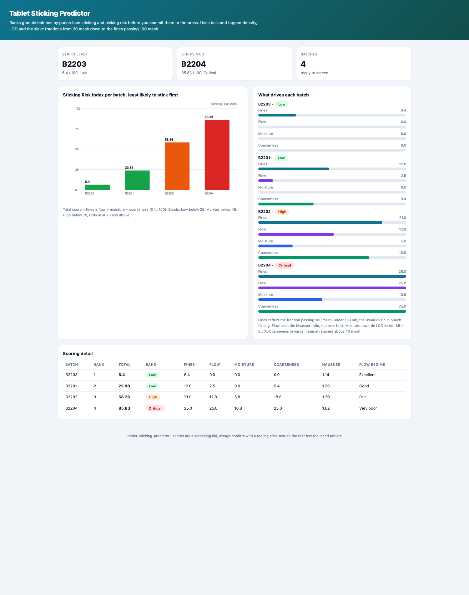](https://marknwilliam.github.io/tablet-sticking-predictor/) | [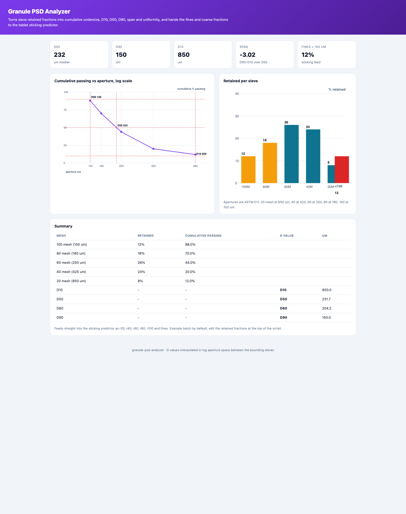](https://marknwilliam.github.io/granule-psd-analyzer/) |

| OSD Tablet QC Dashboard | Batch Assay Calculator |
|---|---|
| [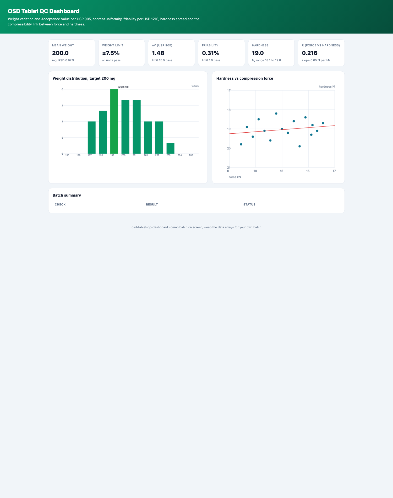](https://marknwilliam.github.io/osd-tablet-qc-dashboard/) | [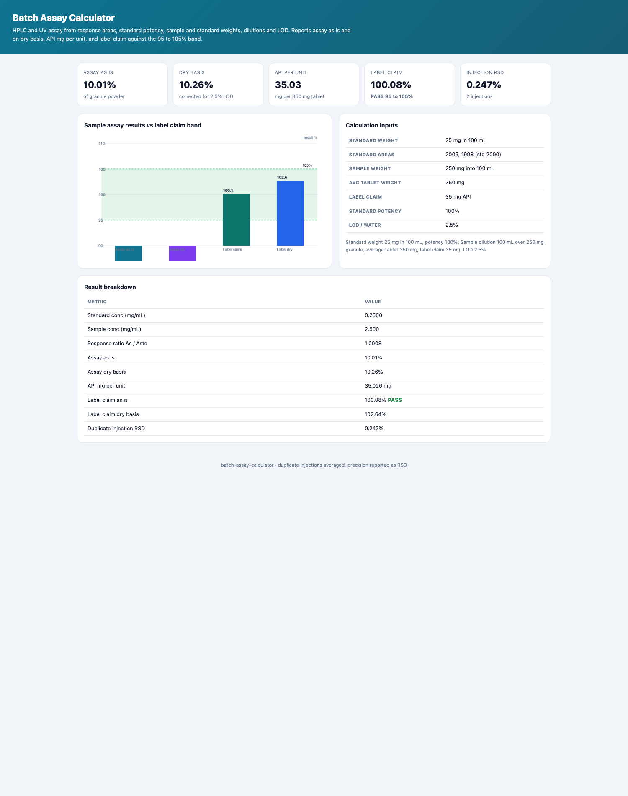](https://marknwilliam.github.io/batch-assay-calculator/) |

| Cumulative Hold Time Calculator |
|---|
| [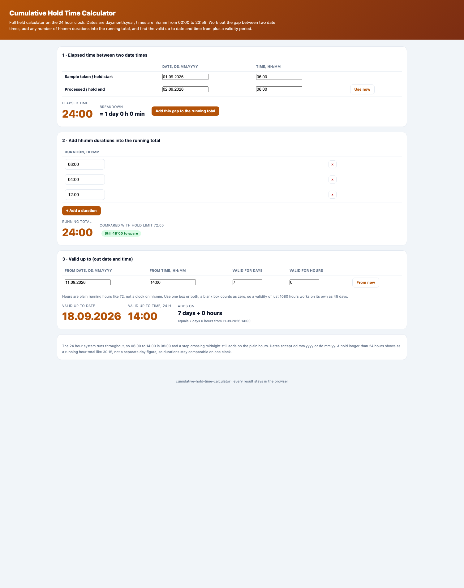](https://marknwilliam.github.io/cumulative-hold-time-calculator/) |

## The engineering thread

- **Math first** — each tool encodes the real method, not demo filler:
  A×P×Q decomposition, USP &lt;645&gt; stage-1 limits, a gradient-descent
  logistic regression, cost build-up and material yield, punch sticking
  scores, USP &lt;905&gt; Acceptance Value, dry basis assay and hold time limits.
- **Testable** — `180` unit tests across the eleven modules; run any of them
  with `python3 -m unittest test_*.py`.
- **Zero-dependency dashboards** — plain HTML/CSS/JS with the native canvas
  API; no build step, no npm, works offline.
- **Interpretable** — no black boxes. Coefficients, limits and decision bands
  are shown next to the charts.

## Repository layout

```
manufacturing-analytics/
├── index.html        # the live gallery (open this)
├── previews/         # README preview screenshots
└── README.md
```

## Author

**Mark William Nkugwa** — Chemical Engineer; Production Officer at a
WHO-prequalified pharmaceutical plant (cGMP, purified-water systems,
batch release). See the full profile on
[GitHub](https://github.com/MarkNwilliam).

## License

MIT.